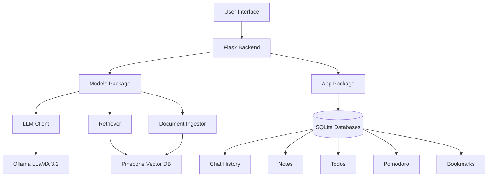

<div align="center">

<!-- Animated Header -->


[](https://git.io/typing-svg)

<br>


<p align="center">
  <a href="#-features">Features</a> •
  <a href="#-tech-stack">Tech Stack</a> •
  <a href="#-installation">Installation</a> •
  <a href="#-usage">Usage</a> •
  <a href="#-architecture">Architecture</a>
</p>

</div>


## 🎯 Overview

<div align="center">
<table>
<tr>
<td width="50%">

**Nexus** is a comprehensive AI-powered study assistant that combines the intelligence of **LLaMA 3.2** with practical productivity tools. Built with Flask and powered by Ollama, it offers intelligent conversations, document-aware Q&A, and a complete suite of study management features.

**Perfect for:**
- 📚 Students managing coursework
- 🎓 Researchers organizing knowledge
- 💼 Professionals learning new skills
- 🧠 Anyone seeking AI-assisted productivity

</td>
<td width="50%">

```python
# Quick Start
git clone https://github.com/deimon999/GigaRepose.git
cd GigaRepose
python -m venv .venv
.venv\Scripts\activate
pip install -r requirements.txt
python app.py

# Visit http://localhost:5000
# Start studying smarter! 🚀
```

</td>
</tr>
</table>
</div>


## ✨ Features

<div align="center">

### 🤖 AI Chat Assistant
<table>
<tr>
<td>

**Intelligent Conversations**
- Powered by Ollama LLaMA 3.2
- Context-aware responses
- Natural language understanding
- Study-optimized prompts

</td>
<td>

**Document Intelligence**
- RAG-based Q&A
- PDF & TXT support
- Smart context retrieval
- Vector search powered

</td>
<td>

**Quick Actions**
- Summarize content
- Generate flashcards
- Explain concepts
- Study assistance

</td>
</tr>
</table>

### 📋 Productivity Suite

<table>
<tr>
<td align="center" width="20%">

#### 📝 Notes Manager
Create & organize study notes with categories, tags, and full search

</td>
<td align="center" width="20%">

#### ✅ Todo List
Manage tasks with priorities, due dates, and progress tracking

</td>
<td align="center" width="20%">

#### ⏱️ Pomodoro Timer
25-min focus sessions with break tracking and analytics

</td>
<td align="center" width="20%">

#### 🔖 Bookmarks
Save resources with categories, tags, and descriptions

</td>
<td align="center" width="20%">

#### 🎮 Brain Break Game
Classic Snake game with high scores for study breaks

</td>
</tr>
</table>

### 📄 Document Manager
<table>
<tr>
<td width="33%">

**File Upload**
- Drag & drop interface
- PDF/TXT support
- 16MB max size
- Secure storage

</td>
<td width="33%">

**Smart Ingestion**
- Chunked processing
- Vector embeddings
- Pinecone integration
- Fast retrieval

</td>
<td width="33%">

**Document Q&A**
- Natural language queries
- Context-aware answers
- Source attribution
- Real-time search

</td>
</tr>
</table>

</div>


## 🛠️ Tech Stack

<div align="center">

### Backend Architecture

<table>
<tr>
<td align="center">

<br><b>Core Framework</b>
<br><sub>Python 3.11+ & Flask 3.0</sub>
</td>
<td align="center">

<br><b>Database</b>
<br><sub>SQLite with Indexing</sub>
</td>
<td align="center">

<br><b>Frontend</b>
<br><sub>Vanilla JS + CSS3</sub>
</td>
</tr>
</table>

### AI/ML Components

| Component | Technology | Purpose |
|-----------|-----------|---------|
| **LLM Engine** | Ollama + LLaMA 3.2 | Natural language processing |
| **Vector Store** | Pinecone | Document embeddings & retrieval |
| **Embeddings** | SentenceTransformers | all-MiniLM-L6-v2 model |
| **RAG Framework** | LangChain | Document processing & chunking |

### Project Structure

```
GigaRepose/
├── 📁 models/              # AI/ML components (NEW!)
│   ├── llm_client.py      # Ollama LLM integration
│   ├── retriever.py       # Pinecone RAG retriever
│   ├── ingest.py          # Document ingestion
│   └── document_manager.py # Doc management
├── 📁 app/                 # Database & utilities
│   ├── chat_db.py         # Chat history
│   ├── notes_db.py        # Notes storage
│   ├── todo_db.py         # Task management
│   ├── pomodoro_db.py     # Timer tracking
│   └── bookmarks_db.py    # Bookmark storage
├── 📁 static/              # Frontend assets
│   ├── css/               # Styles
│   └── js/                # Scripts
├── 📁 templates/           # HTML templates
├── 📁 data/                # Uploaded documents
├── app.py                  # Main application
└── requirements.txt        # Dependencies
```

</div>


## 🚀 Installation

<div align="center">

### Prerequisites

</div>

Before running Nexus, ensure you have:

1. **Python 3.11+** installed ([Download Python](https://www.python.org/downloads/))
2. **Ollama** installed and running ([Download Ollama](https://ollama.ai))
3. **LLaMA 3.2 model** pulled in Ollama:
   ```bash
   ollama pull llama3.2
   ```

<div align="center">

### Setup Steps

</div>

#### 1️⃣ Clone the Repository
```bash
git clone https://github.com/deimon999/GigaRepose.git
cd GigaRepose
```

#### 2️⃣ Create Virtual Environment
```bash
python -m venv .venv
```

#### 3️⃣ Activate Virtual Environment

<table>
<tr>
<td width="50%">

**Windows (PowerShell)**
```powershell
.venv\Scripts\Activate.ps1
```

**Windows (Command Prompt)**
```cmd
.venv\Scripts\activate.bat
```

</td>
<td width="50%">

**Linux/Mac**
```bash
source .venv/bin/activate
```

**Fish Shell**
```fish
source .venv/bin/activate.fish
```

</td>
</tr>
</table>

#### 4️⃣ Install Dependencies
```bash
pip install -r requirements.txt
```

#### 5️⃣ Configure Environment (Optional)

Create a `.env` file for advanced features:

```env
# Ollama Configuration
OLLAMA_BASE_URL=http://localhost:11434

# Pinecone Configuration (Optional - for RAG)
ENABLE_RETRIEVER=0
PINECONE_API_KEY=your_api_key_here
```

#### 6️⃣ Run the Application
```bash
python app.py
```

#### 7️⃣ Open Your Browser
Navigate to: **http://localhost:5000**

<div align="center">

### 🎉 You're all set! Start studying smarter with Nexus!

</div>


## 🎨 Features Deep Dive

<details>
<summary><b>🤖 AI Chat Interface</b></summary>
<br>

**Capabilities:**
- Multi-turn conversations with context retention
- Document-aware responses using RAG
- Code syntax highlighting
- Glass morphism UI design
- Full-width readable messages

**Study Quick Actions:**
- **Summarize**: Get concise summaries of complex topics
- **Flashcards**: Generate study cards from content
- **Explain**: Break down difficult concepts

**Performance:**
- Response caching for faster interactions
- Debounced input to prevent duplicate requests
- Performance monitoring for optimization

</details>

<details>
<summary><b>📝 Notes Manager</b></summary>
<br>

**Features:**
- Rich text editor for detailed notes
- Category organization (Math, Science, History, etc.)
- Tag system for flexible categorization
- Full-text search across all notes
- Automatic timestamps (created/updated)
- Export capabilities

**Database Optimizations:**
- Indexed search for instant results
- Efficient pagination
- Soft delete support

</details>

<details>
<summary><b>✅ Todo List</b></summary>
<br>

**Task Management:**
- Create, complete, and delete tasks
- Priority levels (High, Medium, Low)
- Due date tracking
- Progress statistics
- Filter by status

**Smart Features:**
- Auto-sort by priority and date
- Overdue task highlighting
- Completion percentage tracking

</details>

<details>
<summary><b>⏱️ Pomodoro Timer</b></summary>
<br>

**Focus Sessions:**
- 25-minute work sessions
- 5-minute breaks
- Circular visual timer
- Session history tracking

**Analytics:**
- Daily session count
- Total focus minutes
- Productivity trends
- Task association

</details>

<details>
<summary><b>🔖 Bookmarks Manager</b></summary>
<br>

**Resource Organization:**
- Save important URLs
- Category system
- Multi-tag support
- Descriptions/notes
- Quick search

**Use Cases:**
- Research papers
- Tutorial videos
- Online courses
- Reference materials

</details>

<details>
<summary><b>🎮 Brain Break - Snake Game</b></summary>
<br>

**Classic Snake Gameplay:**
- Smooth controls with Arrow keys or WASD
- Touch controls for mobile devices
- Gradient snake with glowing effects
- Grid-based retro design

**Game Features:**
- Score tracking with real-time display
- Snake length counter
- High score persistence (localStorage)
- Progressive difficulty (speeds up)
- Pause and resume functionality

**Visual Polish:**
- Glass morphism design matching app theme
- Animated food with glow effects
- Colorful gradient snake head
- Game over detection and restart

**Perfect For:**
- Quick 5-minute study breaks
- Pomodoro break periods
- Mental refresh between tasks
- Fun productivity reward

</details>

<details>
<summary><b>📄 Document Manager</b></summary>
<br>

**File Management:**
- Drag & drop upload
- PDF and TXT support
- 16MB file size limit
- Secure file storage

**RAG Integration:**
- Automatic document processing
- Vector embedding generation
- Semantic search capabilities
- Context-aware Q&A

</details>


## 🏗️ Architecture

<div align="center">



### Design Principles

| Principle | Implementation |
|-----------|---------------|
| **Modularity** | Separate packages for models and app logic |
| **Performance** | Database indexing, caching, debouncing |
| **Scalability** | Lazy loading, optional features |
| **Security** | File sanitization, size limits |
| **UX** | Glass morphism, smooth animations |

</div>


## 📊 Performance Optimizations

<div align="center">

| Optimization | Impact | Implementation |
|-------------|--------|----------------|
| **Database Indexing** | 10x faster queries | Strategic indexes on search fields |
| **Request Monitoring** | Track slow endpoints | Performance decorator on routes |
| **Event Debouncing** | Reduced duplicate requests | 300ms debounce on user actions |
| **Lazy Loading** | Faster startup | Optional retriever initialization |
| **Caching** | Improved response time | Static file caching (1 year) |

</div>


## 🔧 Configuration

### Ollama Settings

```python
# models/llm_client.py
base_url = "http://localhost:11434"
model = "llama3.2:latest"
temperature = 0.7
num_predict = 2000
```

### Pinecone RAG (Optional)

To enable document search with RAG:

```bash
# Set environment variable
export ENABLE_RETRIEVER=1

# Add API key to .env
PINECONE_API_KEY=your_key_here
```

Create Pinecone index:
```python
# Dimension: 384 (all-MiniLM-L6-v2)
# Metric: cosine
# Cloud: serverless
```


## 🤝 Contributing

Contributions are welcome! Here's how you can help:

1. 🍴 Fork the repository
2. 🌿 Create a feature branch (`git checkout -b feature/AmazingFeature`)
3. 💾 Commit your changes (`git commit -m 'Add some AmazingFeature'`)
4. 📤 Push to the branch (`git push origin feature/AmazingFeature`)
5. 🎉 Open a Pull Request

<div align="center">

### Development Guidelines

| Area | Standards |
|------|-----------|
| **Code Style** | PEP 8 for Python, ESLint for JS |
| **Testing** | Unit tests for new features |
| **Documentation** | Inline comments and docstrings |
| **Commits** | Conventional commit messages |

</div>


## 📝 License

This project is licensed under the **MIT License** - see the LICENSE file for details.


## 🙏 Acknowledgments

<div align="center">

Built with ❤️ using:

<table>
<tr>
<td align="center">
<a href="https://ollama.ai">

<br>Ollama
</a>
</td>
<td align="center">
<a href="https://www.pinecone.io">

<br>Pinecone
</a>
</td>
<td align="center">
<a href="https://www.langchain.com">

<br>LangChain
</a>
</td>
<td align="center">
<a href="https://flask.palletsprojects.com">

<br>Flask
</a>
</td>
</tr>
</table>

</div>


<div align="center">

## ⭐ Star History

[](https://star-history.com/#deimon999/GigaRepose&Date)

<br>

### 🚀 Made with passion for smarter studying
### 💡 Empowered by AI, Built for Students

<br>

**[⬆ Back to Top](#nexus-ai)**


</div>
